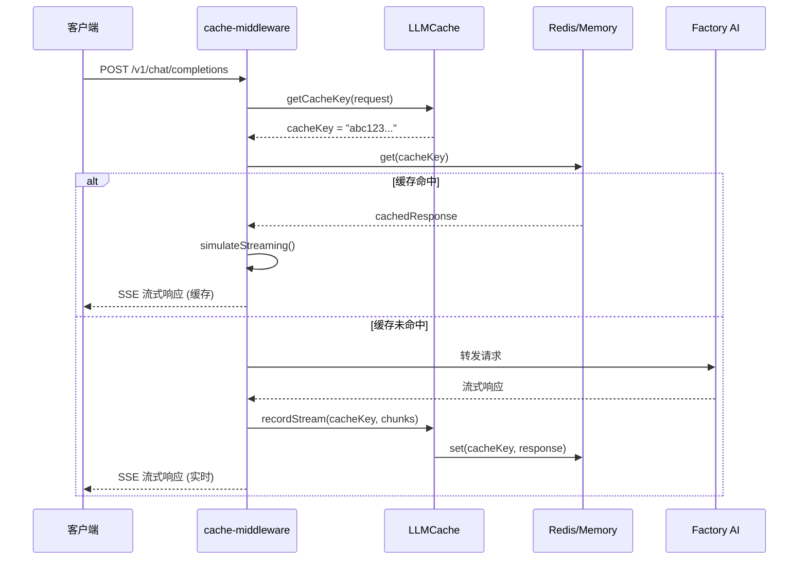

# 🏗️ LLM 缓存系统技术设计文档

> **版本**：v1.0.0
> **最后更新**：2025-10-13
> **配套文档**：[实施计划](./LLM_CACHE_PLAN.md) | [API 文档](./LLM_CACHE_API.md) | [前端设计](./LLM_CACHE_UI.md)

---

## 📋 目录

- [系统架构](#系统架构)
- [核心模块设计](#核心模块设计)
- [数据结构](#数据结构)
- [缓存策略](#缓存策略)
- [性能优化](#性能优化)
- [安全设计](#安全设计)
- [监控和日志](#监控和日志)
- [技术决策](#技术决策)

---

## 🏛️ 系统架构

### 整体架构图

```
┌────────────────────────────────────────────────────────────────┐
│                        客户端请求                              │
└────────────────────────┬───────────────────────────────────────┘
                         ↓
┌────────────────────────────────────────────────────────────────┐
│                    Express 中间件栈                             │
├────────────────────────────────────────────────────────────────┤
│  1. apiKeyAuth (客户端认证)                                    │
│  2. log-collector (日志收集)                                   │
│  3. stats-tracker (统计追踪)                                   │
│  4. 🆕 cache-middleware (缓存层) ← 新增                        │
│     ├─ 请求前: 尝试从缓存读取                                  │
│     └─ 请求后: 将响应写入缓存                                  │
└────────────────────────┬───────────────────────────────────────┘
                         ↓
                  ┌──────┴──────┐
                  │  缓存命中？  │
                  └──────┬──────┘
                         │
          ┌──────────────┼──────────────┐
          ↓ 命中                        ↓ 未命中
┌─────────────────────┐      ┌─────────────────────┐
│  从缓存读取响应      │      │  转发到上游 LLM API │
│  模拟流式返回        │      │  (Factory AI)       │
└─────────┬───────────┘      └─────────┬───────────┘
          │                            │
          │                            ↓
          │                  ┌─────────────────────┐
          │                  │  记录响应到缓存      │
          │                  │  (LLMCache.set)     │
          │                  └─────────┬───────────┘
          │                            │
          └────────────┬───────────────┘
                       ↓
              ┌────────────────────┐
              │   返回客户端        │
              └────────────────────┘
```

### 数据流向



---

## 🧩 核心模块设计

### 1. LLMCache 类（`utils/llm-cache.js`）

**职责**：
- 缓存键生成（模型 + 提示词 + 用户 ID）
- 缓存读写（支持 Redis 和内存）
- 缓存清理（TTL 过期、LRU 淘汰）
- 统计数据收集（命中率、Token 节省）

**类定义**：

```javascript
class LLMCache {
    constructor(config = {}) {
        this.config = {
            enabled: config.enabled !== false,
            type: config.type || 'memory',  // 'memory' | 'redis'
            ttl: config.ttl || 86400,        // 24 小时
            maxSize: config.maxSize || 1000, // 最多缓存 1000 条
            strategy: config.strategy || 'fuzzy',  // 'exact' | 'fuzzy'
            redis: config.redis || null
        };

        // 内存缓存（LRU）
        this.memoryCache = new Map();
        this.cacheAccessOrder = [];

        // Redis 客户端
        this.redisClient = null;
        if (this.config.type === 'redis' && this.config.redis) {
            this.initRedis();
        }

        // 统计数据
        this.stats = {
            totalRequests: 0,
            cacheHits: 0,
            cacheMisses: 0,
            tokensSaved: 0
        };

        // 启动清理任务
        if (config.autoCleanup !== false) {
            this.startCleanupTask();
        }
    }

    /**
     * 生成缓存键
     * @param {Object} request - 请求对象
     * @returns {string} 缓存键
     */
    getCacheKey(request) {
        const { model, messages, userId } = request;

        // 提取系统提示词和用户消息（只取前 200 字符）
        const systemPrompt = messages.find(m => m.role === 'system')?.content || '';
        const userMessage = messages.find(m => m.role === 'user')?.content || '';
        const userMessagePrefix = userMessage.substring(0, 200);

        // 构造缓存键原文
        const keyData = {
            model,
            systemPrompt,
            userMessage: userMessagePrefix,
            userId: userId || 'anonymous'
        };

        // 模糊匹配模式：忽略采样参数（temperature, max_tokens 等）
        if (this.config.strategy === 'fuzzy') {
            // 只用模型、提示词、用户 ID 生成键
        } else {
            // 精确匹配模式：包含所有参数
            keyData.temperature = request.temperature;
            keyData.max_tokens = request.max_tokens;
            keyData.top_p = request.top_p;
        }

        // SHA256 哈希
        const crypto = require('crypto');
        const hash = crypto.createHash('sha256');
        hash.update(JSON.stringify(keyData));
        return hash.digest('hex');
    }

    /**
     * 获取缓存
     * @param {string} cacheKey - 缓存键
     * @returns {Promise<Object|null>}
     */
    async get(cacheKey) {
        if (!this.config.enabled) return null;

        this.stats.totalRequests++;

        try {
            let cachedData = null;

            if (this.config.type === 'redis' && this.redisClient) {
                const rawData = await this.redisClient.get(`llm_cache:${cacheKey}`);
                if (rawData) {
                    cachedData = JSON.parse(rawData);
                }
            } else {
                cachedData = this.memoryCache.get(cacheKey);
            }

            if (cachedData) {
                // 检查 TTL
                const now = Date.now();
                if (cachedData.expiresAt && now > cachedData.expiresAt) {
                    // 已过期，删除
                    await this.delete(cacheKey);
                    this.stats.cacheMisses++;
                    return null;
                }

                // 命中，更新访问记录
                this.stats.cacheHits++;
                this.updateAccessOrder(cacheKey);
                cachedData.metadata.hits++;
                cachedData.metadata.lastHitAt = new Date().toISOString();

                // 更新缓存（写回 hits 计数）
                await this.set(cacheKey, cachedData, { skipTTL: true });

                return cachedData;
            } else {
                this.stats.cacheMisses++;
                return null;
            }
        } catch (error) {
            logError('LLMCache.get error:', error);
            this.stats.cacheMisses++;
            return null;
        }
    }

    /**
     * 设置缓存
     * @param {string} cacheKey - 缓存键
     * @param {Object} data - 缓存数据
     * @param {Object} options - 选项
     */
    async set(cacheKey, data, options = {}) {
        if (!this.config.enabled) return;

        try {
            const now = Date.now();
            const expiresAt = options.skipTTL ? data.expiresAt : (now + this.config.ttl * 1000);

            const cacheData = {
                ...data,
                expiresAt,
                metadata: {
                    ...data.metadata,
                    cachedAt: data.metadata?.cachedAt || new Date().toISOString(),
                    size: JSON.stringify(data).length
                }
            };

            if (this.config.type === 'redis' && this.redisClient) {
                await this.redisClient.setEx(
                    `llm_cache:${cacheKey}`,
                    this.config.ttl,
                    JSON.stringify(cacheData)
                );
            } else {
                // 内存缓存 LRU 淘汰
                if (this.memoryCache.size >= this.config.maxSize) {
                    const oldestKey = this.cacheAccessOrder.shift();
                    this.memoryCache.delete(oldestKey);
                }

                this.memoryCache.set(cacheKey, cacheData);
                this.updateAccessOrder(cacheKey);
            }
        } catch (error) {
            logError('LLMCache.set error:', error);
        }
    }

    /**
     * 删除缓存
     * @param {string} cacheKey - 缓存键
     */
    async delete(cacheKey) {
        try {
            if (this.config.type === 'redis' && this.redisClient) {
                await this.redisClient.del(`llm_cache:${cacheKey}`);
            } else {
                this.memoryCache.delete(cacheKey);
                this.cacheAccessOrder = this.cacheAccessOrder.filter(k => k !== cacheKey);
            }
        } catch (error) {
            logError('LLMCache.delete error:', error);
        }
    }

    /**
     * 清空所有缓存
     * @param {Object} filters - 筛选条件（如 model）
     * @returns {Promise<number>} 清空的数量
     */
    async clear(filters = {}) {
        let cleared = 0;

        try {
            if (this.config.type === 'redis' && this.redisClient) {
                const keys = await this.redisClient.keys('llm_cache:*');

                for (const key of keys) {
                    const rawData = await this.redisClient.get(key);
                    if (rawData) {
                        const data = JSON.parse(rawData);

                        // 应用筛选条件
                        if (filters.model && data.request.model !== filters.model) {
                            continue;
                        }

                        await this.redisClient.del(key);
                        cleared++;
                    }
                }
            } else {
                for (const [key, data] of this.memoryCache.entries()) {
                    if (filters.model && data.request.model !== filters.model) {
                        continue;
                    }

                    this.memoryCache.delete(key);
                    cleared++;
                }

                this.cacheAccessOrder = [];
            }
        } catch (error) {
            logError('LLMCache.clear error:', error);
        }

        return cleared;
    }

    /**
     * 获取缓存列表
     * @param {Object} options - 选项（page, limit, model, sort）
     * @returns {Promise<Object>} { total, caches }
     */
    async list(options = {}) {
        const { page = 1, limit = 50, model = null, sort = 'hits' } = options;

        let allCaches = [];

        try {
            if (this.config.type === 'redis' && this.redisClient) {
                const keys = await this.redisClient.keys('llm_cache:*');

                for (const key of keys) {
                    const rawData = await this.redisClient.get(key);
                    if (rawData) {
                        const data = JSON.parse(rawData);
                        allCaches.push({
                            cacheKey: key.replace('llm_cache:', ''),
                            ...this.formatCacheEntry(data)
                        });
                    }
                }
            } else {
                for (const [key, data] of this.memoryCache.entries()) {
                    allCaches.push({
                        cacheKey: key,
                        ...this.formatCacheEntry(data)
                    });
                }
            }

            // 筛选模型
            if (model) {
                allCaches = allCaches.filter(c => c.model === model);
            }

            // 排序
            const sortFunctions = {
                hits: (a, b) => b.hits - a.hits,
                created: (a, b) => new Date(b.createdAt) - new Date(a.createdAt),
                size: (a, b) => b.size - a.size
            };

            allCaches.sort(sortFunctions[sort] || sortFunctions.hits);

            // 分页
            const total = allCaches.length;
            const start = (page - 1) * limit;
            const end = start + limit;
            const caches = allCaches.slice(start, end);

            return { total, caches };
        } catch (error) {
            logError('LLMCache.list error:', error);
            return { total: 0, caches: [] };
        }
    }

    /**
     * 格式化缓存条目
     * @param {Object} data - 原始缓存数据
     * @returns {Object} 格式化后的条目
     */
    formatCacheEntry(data) {
        const userMessage = data.request.messages.find(m => m.role === 'user')?.content || '';
        const requestSummary = userMessage.substring(0, 100);

        return {
            model: data.request.model,
            requestSummary,
            createdAt: data.metadata.cachedAt,
            hits: data.metadata.hits || 0,
            size: data.metadata.size || 0,
            ttl: this.config.ttl,
            age: Math.floor((Date.now() - new Date(data.metadata.cachedAt).getTime()) / 1000)
        };
    }

    /**
     * 获取统计数据
     * @returns {Object} 统计信息
     */
    getStats() {
        const hitRate = this.stats.totalRequests > 0
            ? ((this.stats.cacheHits / this.stats.totalRequests) * 100).toFixed(2)
            : '0.00';

        return {
            overview: {
                totalRequests: this.stats.totalRequests,
                cacheHits: this.stats.cacheHits,
                cacheMisses: this.stats.cacheMisses,
                hitRate: `${hitRate}%`
            },
            storage: {
                type: this.config.type,
                totalCaches: this.memoryCache.size,
                maxSize: this.config.maxSize
            },
            savings: {
                tokensSaved: this.stats.tokensSaved
            }
        };
    }

    /**
     * 更新访问顺序（LRU）
     */
    updateAccessOrder(cacheKey) {
        this.cacheAccessOrder = this.cacheAccessOrder.filter(k => k !== cacheKey);
        this.cacheAccessOrder.push(cacheKey);
    }

    /**
     * 初始化 Redis 客户端
     */
    async initRedis() {
        try {
            const redis = require('redis');
            this.redisClient = redis.createClient(this.config.redis);

            await this.redisClient.connect();
            logInfo('✅ Redis 缓存已连接');
        } catch (error) {
            logError('❌ Redis 连接失败，降级到内存缓存:', error);
            this.config.type = 'memory';
            this.redisClient = null;
        }
    }

    /**
     * 启动清理任务（每小时）
     */
    startCleanupTask() {
        setInterval(async () => {
            logInfo('🧹 开始清理过期缓存...');

            const now = Date.now();
            let cleaned = 0;

            for (const [key, data] of this.memoryCache.entries()) {
                if (data.expiresAt && now > data.expiresAt) {
                    this.memoryCache.delete(key);
                    cleaned++;
                }
            }

            logInfo(`🧹 清理完成，删除 ${cleaned} 条过期缓存`);
        }, 3600 * 1000);  // 每小时
    }
}

module.exports = LLMCache;
```

---

### 2. Cache Middleware（`middleware/cache-middleware.js`）

**职责**：
- 拦截 `/v1/chat/completions` 请求
- 请求前：尝试从缓存读取，命中则返回
- 请求后：将响应写入缓存

**实现**：

```javascript
const LLMCache = require('../utils/llm-cache.js');
const { logInfo, logDebug } = require('../logger.js');
const { Readable } = require('stream');

// 初始化缓存实例
const cache = new LLMCache({
    enabled: process.env.CACHE_ENABLED !== 'false',
    type: process.env.CACHE_TYPE || 'memory',
    ttl: parseInt(process.env.CACHE_TTL || '86400'),
    maxSize: parseInt(process.env.CACHE_MAX_SIZE || '1000'),
    strategy: process.env.CACHE_STRATEGY || 'fuzzy',
    redis: process.env.REDIS_HOST ? {
        socket: {
            host: process.env.REDIS_HOST || '127.0.0.1',
            port: parseInt(process.env.REDIS_PORT || '6379')
        },
        password: process.env.REDIS_PASSWORD || undefined
    } : null
});

/**
 * 缓存中间件
 */
async function cacheMiddleware(req, res, next) {
    // 只缓存 /v1/chat/completions
    if (req.path !== '/v1/chat/completions') {
        return next();
    }

    // 只缓存 POST 请求
    if (req.method !== 'POST') {
        return next();
    }

    try {
        const requestBody = req.body;

        // 生成缓存键
        const cacheKey = cache.getCacheKey({
            model: requestBody.model,
            messages: requestBody.messages,
            userId: req.headers['x-user-id'] || 'anonymous'
        });

        logDebug(`🔍 缓存键: ${cacheKey}`);

        // 尝试从缓存读取
        const cachedResponse = await cache.get(cacheKey);

        if (cachedResponse) {
            logInfo(`✅ 缓存命中: ${cacheKey.substring(0, 16)}...`);

            // 流式响应
            if (requestBody.stream) {
                return await sendCachedStreamResponse(res, cachedResponse);
            } else {
                // 非流式响应
                return res.json(cachedResponse.response);
            }
        } else {
            logInfo(`❌ 缓存未命中: ${cacheKey.substring(0, 16)}...`);

            // 缓存未命中，继续处理请求
            // 拦截响应，记录到缓存
            const originalJson = res.json.bind(res);
            const originalWrite = res.write.bind(res);
            const originalEnd = res.end.bind(res);

            let responseData = null;
            let streamChunks = [];

            // 拦截 res.json()
            res.json = function(data) {
                responseData = data;

                // 写入缓存
                cache.set(cacheKey, {
                    request: {
                        model: requestBody.model,
                        messages: requestBody.messages
                    },
                    response: data,
                    metadata: {
                        hits: 0,
                        cachedAt: new Date().toISOString()
                    }
                });

                return originalJson(data);
            };

            // 拦截 res.write() 和 res.end()（流式响应）
            if (requestBody.stream) {
                res.write = function(chunk) {
                    streamChunks.push(chunk);
                    return originalWrite(chunk);
                };

                res.end = function(chunk) {
                    if (chunk) streamChunks.push(chunk);

                    // 解析流式响应
                    const fullResponse = parseStreamChunks(streamChunks);

                    // 写入缓存
                    cache.set(cacheKey, {
                        request: {
                            model: requestBody.model,
                            messages: requestBody.messages
                        },
                        response: fullResponse,
                        streamChunks: streamChunks.map(c => c.toString()),
                        metadata: {
                            hits: 0,
                            cachedAt: new Date().toISOString()
                        }
                    });

                    return originalEnd(chunk);
                };
            }

            next();
        }
    } catch (error) {
        logError('Cache middleware error:', error);
        next();  // 缓存失败不影响正常流程
    }
}

/**
 * 发送缓存的流式响应（模拟）
 */
async function sendCachedStreamResponse(res, cachedData) {
    res.setHeader('Content-Type', 'text/event-stream');
    res.setHeader('Cache-Control', 'no-cache');
    res.setHeader('Connection', 'keep-alive');

    const chunks = cachedData.streamChunks || [];

    for (const chunk of chunks) {
        res.write(chunk);
        // 模拟延迟（10ms）
        await new Promise(resolve => setTimeout(resolve, 10));
    }

    res.end();
}

/**
 * 解析流式响应块
 */
function parseStreamChunks(chunks) {
    const lines = chunks.map(c => c.toString()).join('').split('\n');
    const dataLines = lines.filter(line => line.startsWith('data: ') && line !== 'data: [DONE]');

    let fullContent = '';
    let usage = null;

    for (const line of dataLines) {
        try {
            const json = JSON.parse(line.substring(6));  // 去掉 'data: ' 前缀

            if (json.choices && json.choices[0]?.delta?.content) {
                fullContent += json.choices[0].delta.content;
            }

            if (json.usage) {
                usage = json.usage;
            }
        } catch (error) {
            // 忽略解析错误
        }
    }

    return {
        id: `cached-${Date.now()}`,
        object: 'chat.completion',
        created: Math.floor(Date.now() / 1000),
        model: 'cached',
        choices: [{
            index: 0,
            message: {
                role: 'assistant',
                content: fullContent
            },
            finish_reason: 'stop'
        }],
        usage: usage || {
            prompt_tokens: 0,
            completion_tokens: 0,
            total_tokens: 0
        }
    };
}

module.exports = { cacheMiddleware, cache };
```

---

## 📊 数据结构

### 缓存数据结构

```javascript
{
  "request": {
    "model": "claude-sonnet-4",
    "messages": [
      { "role": "system", "content": "You are a helpful assistant." },
      { "role": "user", "content": "如何使用 API？" }
    ]
  },
  "response": {
    "id": "chatcmpl-abc123",
    "object": "chat.completion",
    "created": 1697000000,
    "model": "claude-sonnet-4",
    "choices": [
      {
        "index": 0,
        "message": {
          "role": "assistant",
          "content": "使用 API 的步骤如下：\n1. 获取 API Key...\n2. ..."
        },
        "finish_reason": "stop"
      }
    ],
    "usage": {
      "prompt_tokens": 25,
      "completion_tokens": 150,
      "total_tokens": 175
    }
  },
  "streamChunks": [
    "data: {\"id\":\"chatcmpl-abc123\",\"choices\":[{\"delta\":{\"content\":\"使用\"}}]}\n\n",
    "data: {\"id\":\"chatcmpl-abc123\",\"choices\":[{\"delta\":{\"content\":\" API\"}}]}\n\n",
    "data: [DONE]\n\n"
  ],
  "metadata": {
    "cachedAt": "2025-10-13T12:34:56.789Z",
    "hits": 15,
    "lastHitAt": "2025-10-13T14:56:23.456Z",
    "size": 2345,
    "expiresAt": 1697086400000
  }
}
```

### Redis 键命名规范

```
llm_cache:{cacheKey}                    - 缓存数据
llm_cache_stats:hits                    - 全局命中次数
llm_cache_stats:misses                  - 全局未命中次数
llm_cache_stats:tokens_saved            - 全局节省 Token 数
llm_cache_index:model:{model}           - 模型索引（用于筛选）
llm_cache_index:user:{userId}           - 用户索引
```

---

## 🎯 缓存策略

### 1. 缓存键生成策略

**模糊匹配策略（推荐）**：
```javascript
cacheKey = SHA256({
  model,
  systemPrompt,
  userMessage: userMessage.substring(0, 200),
  userId
})
```

**忽略的参数**：
- `temperature`
- `max_tokens`
- `top_p`
- `frequency_penalty`
- `presence_penalty`

**原因**：这些参数对结果影响较小，忽略它们可以显著提高命中率。

**精确匹配策略**：
```javascript
cacheKey = SHA256({
  model,
  systemPrompt,
  userMessage: userMessage.substring(0, 200),
  userId,
  temperature,
  max_tokens,
  top_p
})
```

**适用场景**：对响应一致性要求极高的场景。

---

### 2. 缓存淘汰策略

**LRU（Least Recently Used）**：
- 内存缓存达到 `maxSize` 时触发
- 删除最久未访问的缓存
- 通过 `cacheAccessOrder` 数组维护访问顺序

**TTL（Time To Live）**：
- 默认 24 小时过期
- 每次访问时检查 `expiresAt` 时间戳
- 定时清理任务每小时运行一次

**手动清理**：
- 管理员可通过 `/admin/cache/clear` 清空所有缓存
- 支持按模型筛选清理

---

### 3. 流式响应缓存

**挑战**：
- 流式响应是分块发送的，无法一次性获取完整响应
- 需要拦截所有 `res.write()` 调用，记录每个块

**解决方案**：
1. **记录阶段**：拦截 `res.write()` 和 `res.end()`，将所有块存入 `streamChunks` 数组
2. **缓存阶段**：在 `res.end()` 时，将完整的 `streamChunks` 写入缓存
3. **播放阶段**：从缓存读取 `streamChunks`，按原速率（10ms/块）逐块发送给客户端

**关键代码**：
```javascript
// 记录流式响应
res.write = function(chunk) {
    streamChunks.push(chunk);
    return originalWrite(chunk);
};

res.end = function(chunk) {
    if (chunk) streamChunks.push(chunk);

    // 写入缓存
    cache.set(cacheKey, {
        streamChunks: streamChunks.map(c => c.toString()),
        ...
    });

    return originalEnd(chunk);
};

// 播放流式响应
async function sendCachedStreamResponse(res, cachedData) {
    for (const chunk of cachedData.streamChunks) {
        res.write(chunk);
        await new Promise(resolve => setTimeout(resolve, 10));  // 模拟延迟
    }
    res.end();
}
```

---

## ⚡ 性能优化

### 1. 缓存命中率优化

**目标**：命中率 > 50%

**策略**：
- **模糊匹配**：忽略采样参数，提高命中率 20-30%
- **提示词前缀匹配**：只取用户消息前 200 字符，避免细节差异导致未命中
- **用户隔离**：相同用户的相似请求更可能命中

**监控指标**：
```javascript
hitRate = (cacheHits / totalRequests) * 100
```

---

### 2. 延迟优化

**目标**：缓存响应延迟 < 50ms

**瓶颈分析**：
- Redis 网络延迟：2-5ms
- JSON 解析：1-2ms
- 流式模拟：10ms × N 块

**优化方案**：
- **Redis Pipeline**：批量读取多个缓存键（如果支持）
- **数据压缩**：使用 gzip 压缩 `streamChunks`，减少存储和传输时间
- **本地缓存预热**：常用模型的热门请求提前加载到内存

---

### 3. 存储优化

**目标**：在有限存储空间内最大化缓存数量

**策略**：
- **数据压缩**：使用 LZ4 或 Brotli 压缩 `response` 和 `streamChunks`，减少 50-70% 存储空间
- **选择性缓存**：只缓存 Token 数 > 100 的响应（短响应缓存价值低）
- **渐进式淘汰**：存储达到 80% 时，提前淘汰低命中缓存

**示例**：
```javascript
// 压缩缓存数据
const zlib = require('zlib');

async function compressData(data) {
    return new Promise((resolve, reject) => {
        zlib.brotliCompress(JSON.stringify(data), (err, compressed) => {
            if (err) reject(err);
            else resolve(compressed.toString('base64'));
        });
    });
}

async function decompressData(compressed) {
    return new Promise((resolve, reject) => {
        const buffer = Buffer.from(compressed, 'base64');
        zlib.brotliDecompress(buffer, (err, decompressed) => {
            if (err) reject(err);
            else resolve(JSON.parse(decompressed.toString()));
        });
    });
}
```

---

## 🔒 安全设计

### 1. 用户隔离

**问题**：不同用户的缓存可能泄露敏感信息

**解决方案**：
- 在缓存键中包含 `userId`（从 `x-user-id` Header 提取）
- 确保 User A 无法访问 User B 的缓存

**缓存键示例**：
```javascript
cacheKey = SHA256({
    model: 'claude-sonnet-4',
    systemPrompt: '...',
    userMessage: '...',
    userId: 'user_abc123'  // 🔒 用户 ID
})
```

---

### 2. 敏感数据过滤

**问题**：缓存中可能包含用户的敏感信息（如 API Key、密码）

**解决方案**：
- **请求检测**：在缓存前检测请求内容是否包含敏感关键词（如 `password`, `api_key`, `secret`）
- **跳过缓存**：检测到敏感信息时，直接转发请求，不缓存

**示例**：
```javascript
function containsSensitiveData(messages) {
    const sensitivePatterns = [
        /password/i,
        /api[_\s-]?key/i,
        /secret/i,
        /token/i,
        /\b[a-f0-9]{32,}\b/i  // 疑似哈希值
    ];

    for (const message of messages) {
        const content = message.content || '';
        for (const pattern of sensitivePatterns) {
            if (pattern.test(content)) {
                return true;
            }
        }
    }

    return false;
}

// 在 cacheMiddleware 中使用
if (containsSensitiveData(requestBody.messages)) {
    logInfo('⚠️ 检测到敏感数据，跳过缓存');
    return next();
}
```

---

### 3. 缓存投毒防护

**问题**：恶意用户可能通过特定请求污染缓存，影响其他用户

**解决方案**：
- **用户隔离**（见上文）
- **缓存验证**：在返回缓存前，验证响应的合法性（如 Token 数合理、无异常字符）
- **缓存审计**：记录缓存写入日志，可追溯异常缓存来源

---

## 📈 监控和日志

### 1. 关键指标

| 指标 | 描述 | 告警阈值 |
|------|------|----------|
| **命中率** | cacheHits / totalRequests | < 30% |
| **平均延迟** | 缓存响应平均时间 | > 100ms |
| **存储使用率** | 已用存储 / 最大存储 | > 80% |
| **错误率** | 缓存读写失败次数 / 总次数 | > 5% |

### 2. 日志记录

**缓存命中日志**：
```
[2025-10-13 12:34:56] [INFO] ✅ 缓存命中: abc123... (model: claude-sonnet-4, hits: 15)
```

**缓存写入日志**：
```
[2025-10-13 12:35:10] [INFO] 💾 缓存写入: abc123... (model: claude-sonnet-4, size: 2345 bytes)
```

**缓存清理日志**：
```
[2025-10-13 13:00:00] [INFO] 🧹 清理完成，删除 12 条过期缓存
```

### 3. 监控集成

**Prometheus 指标暴露**：
```javascript
// 在 server.js 中添加 /metrics 端点
const promClient = require('prom-client');

const cacheHitsCounter = new promClient.Counter({
    name: 'llm_cache_hits_total',
    help: 'Total number of cache hits'
});

const cacheMissesCounter = new promClient.Counter({
    name: 'llm_cache_misses_total',
    help: 'Total number of cache misses'
});

const cacheLatencyHistogram = new promClient.Histogram({
    name: 'llm_cache_latency_seconds',
    help: 'Cache response latency',
    buckets: [0.001, 0.005, 0.01, 0.05, 0.1, 0.5, 1]
});

// 在 cacheMiddleware 中更新指标
if (cachedResponse) {
    cacheHitsCounter.inc();
} else {
    cacheMissesCounter.inc();
}
```

---

## 🛠️ 技术决策

### 决策 1：使用内存缓存还是 Redis？

| 方案 | 优点 | 缺点 | 适用场景 |
|------|------|------|----------|
| **内存缓存** | 零依赖、超低延迟 (< 1ms) | 无持久化、单进程 | 日均请求 < 10 万、单机部署 |
| **Redis** | 持久化、支持集群、多进程共享 | 需额外部署、网络延迟 (2-5ms) | 日均请求 > 10 万、多进程部署 |

**推荐**：Phase 1 使用内存缓存，Phase 2 升级到 Redis。

---

### 决策 2：精确匹配 vs 模糊匹配？

| 策略 | 命中率 | 一致性 | 推荐场景 |
|------|--------|--------|----------|
| **精确匹配** | 低 (20-30%) | 完全一致 | 金融、医疗等对结果一致性要求极高的场景 |
| **模糊匹配** | 高 (50-70%) | 基本一致 | 通用场景（推荐） |

**推荐**：默认模糊匹配，提供配置选项允许切换。

---

### 决策 3：缓存 TTL 设置多久？

| TTL | 命中率 | 存储占用 | 数据新鲜度 |
|-----|--------|----------|-----------|
| 1 小时 | 低 | 低 | 高 |
| 24 小时 | 中 | 中 | 中 |
| 7 天 | 高 | 高 | 低 |

**推荐**：默认 24 小时，提供配置选项。

---

### 决策 4：流式响应如何缓存？

**方案 A**：只缓存完整响应（不支持流式）
- 优点：实现简单
- 缺点：用户体验差（首字延迟高）

**方案 B**：缓存流式响应块，模拟播放（推荐）
- 优点：用户体验一致
- 缺点：实现复杂、存储占用大

**推荐**：方案 B，提供与原始流式响应一致的体验。

---

## 📚 参考资料

- [Redis 官方文档](https://redis.io/docs/)
- [Express.js 中间件指南](https://expressjs.com/en/guide/using-middleware.html)
- [Node.js Stream 文档](https://nodejs.org/api/stream.html)
- [LRU Cache 算法](https://en.wikipedia.org/wiki/Cache_replacement_policies#Least_recently_used_(LRU))

---

## 🎉 总结

本文档详细设计了 **LLM 缓存系统的技术架构**，涵盖：

1. **系统架构**：中间件拦截 → 缓存读取 → 模拟流式响应
2. **核心模块**：`LLMCache` 类 + `cache-middleware`
3. **数据结构**：缓存键、缓存数据、Redis 键命名
4. **缓存策略**：模糊匹配、LRU 淘汰、流式响应缓存
5. **性能优化**：命中率、延迟、存储空间
6. **安全设计**：用户隔离、敏感数据过滤、缓存投毒防护
7. **监控日志**：Prometheus 集成、关键指标告警

**预期效果**：
- 命中率 > 50%
- 延迟降低 95%（2500ms → 50ms）
- Token 节省 30-60%
- 成本降低 30-60%

---

**文档版本**：v1.0.0
**作者**：BaSui
**最后更新**：2025-10-13
